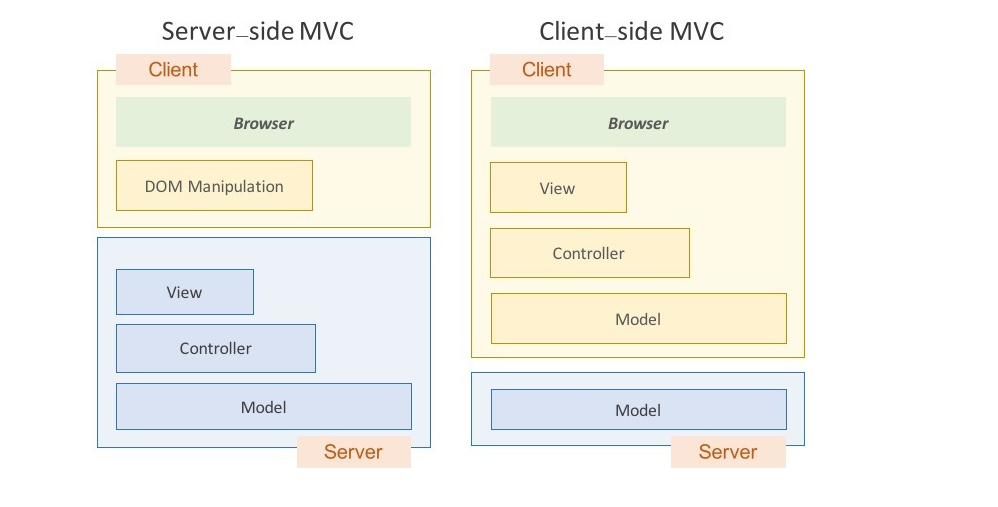
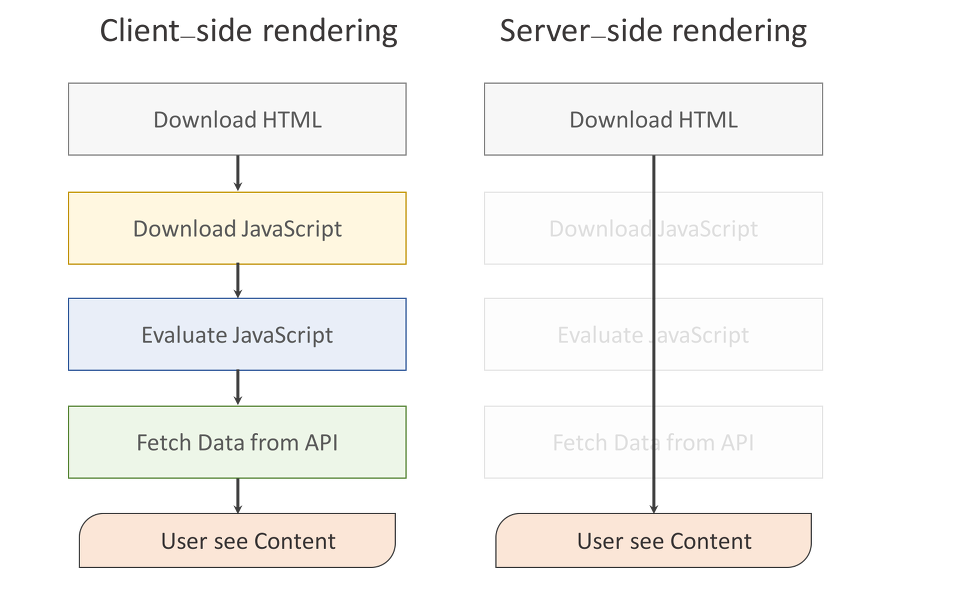

# 09주차

### 1. 바인딩

 두 데이터 혹은 정보의 소스를 일치시키는 기법으로, 화면에 보이는 데이터와 브라우저 메모리에 있는 데이터(여러개의 자바스크립트 객체)를 일치시키는 것을 말한다.
예를 들어, MVC 모델에서 model과 view를 서로 묶어 model과 view의 "자동 동기화" 시키기 라고 이해할 수 있다.

### 2. 단방향 & 양방향 바인딩

#### 양방향 데이터 바인딩

- 장점 : 코드의 사용면에서 코드량을 크게 줄여줌
- 단점 : 변화에 따라 DOM 객체 전체를 렌더링해주거나 데이터를 바꿔주므로, 성능이 감소되는 경우가 있음

`컨트롤러`에서 `model`이 변경됨 -> `view`변경됨
`view`에서 `scope model`이 변경됨 -> `컨트롤러`에서 `model`이 변경됨

- 이렇게 `컨트롤러`와 `뷰` 양쪽의 데이터 일치가 모두 가능한 것이 양방향 데이터 바인딩이다. 데이터의 변화를 감지해 템플릿과 결합해 화면을 갱신, 화면의 입력에 따라 데이터를 갱신하는 것이다. (HTML -> JS, JS -> HTML 양쪽 모두 가능)
- 양방향 데이터 바인딩은 데이터의 변경을 프레임워크에서 감지하고 있다가, 데이터가 변경되는 시점에 DOM 객체에 렌더링을 해주거나 페이지 내에서 모델의 변경을 감지해 JS 실행부에서 변경한다. 입력된 값이나 변경된 값에 따라 내용이 바로 바뀌기 때문에 따로 체크해주지 않아도 된다.
- 양방향 데이터 바인딩은 웹 애플리케이션의 복잡도가 증가하면 증가할수록 빛을 발한다. 수많은 코드의 양을 줄여줄 뿐만 아니라 유지보수나 코드를 관리하기 매우 쉽게 해주기 때문이다.

예를 들어 vue.js 에서는

- V-model과 V-on을 통해 양방향 데이터 바인딩을 한다.
- v-model이 DOM 연관된 내용을 잡아내고, vue가 바라보는 대상의 속성과 연결됨.
- v-on은 이벤트를 잡아내는 데 사용한다. ( DOM 이벤트 -> click, key press, mouse move 등)

#### 단방향 데이터 바인딩

- 장점 : 데이터 변화에 따른 성능 저하 없이 DOM 객체 갱신 가능,
  데이터 흐름이 단방향(부모->하위 컴포넌트)이라, 코드를 이해하기 쉽고 데이터 추적과 디버깅이 쉬움
- 단점: 변화를 감지하고 화면을 업데이트 하는 코드를 매번 작성해야 함

- 대표적으로 `React`가 단방향 데이터 바인딩을 한다.
- 단방향 데이터 바인딩은 데이터와 템플릿을 결합해 화면을 생성하는 것이다. (JS -> HTML만 가능)
- 사용자의 입력에 따라 데이터를 갱신하고 화면을 업데이트 해야 하므로 단방향 데이터 바인딩으로 구성하면, 데이터의 변화를 감지하고 화면을 업데이트 하는 코드를 매번 작성해주어야 한다.
- 리액트는 자바스크립트 기반으로, 부모 뷰->자식 뷰 바뀐 내용을 직접 전달한다.

### 3. 크로스 브라우징

 웹 표준에 따라 개발을 하여 서로 다른 OS 또는 플랫폼에 대응하는 것을 말한다. 즉, 브라우저의 렌더링 엔진이 다른 경우에 인터넷이 이상없이 구현되도록 하는 기술이다. 웹 사이트를 서로 비슷하게 만들어 어떤 **환경** 에서도 이상없이 작동되게 하는데 그 목적이 있다. 즉, 어느 한쪽에 최적화되어 치우치지 않도록 공통요소를 사용하여 웹 페이지를 제작하는 방법을 말한다.

### 4. Document Object Model (DOM)

웹에서는 수많은 이벤트(Event)가 발생하고 흐른다.

- 브라우저(user agent)로부터 발생하는 이벤트
- 사용자의 행동(interaction)에 의해 발생하는 이벤트
- DOM의 ‘변화’로 인해 발생하는 이벤트

발생하는 이벤트는 그저 자바스크립트 객체일 뿐이다. 브라우저의 Event interface에 맞춰 구현된 객체인 것이다.

여러 DOM Element로 구성된 하나의 웹 페이지는 Window를 최상위로 하는 트리를 생성하게 된다. 결론부터 말하자면 이벤트는 이벤트 각각이 갖게 되는 전파 경로(propagation path)를 따라 전파된다. 그리고 이 전파 경로는 DOM Tree 구조에서 Element의 위상(hierarchy)에 의해 결정이 된다.

### 5. 서버 사이드 렌더링 & 클라이언트 사이드 렌더링

- 데스크탑에 비해 성능이 낮은 모바일, 스마트폰을 통해 웹 페이지를 출력하기 위해서는 기존에 있었던 방식과는 다른 접근이 필요했고 그에 따라서 Singla Page web Application 기법 **(SPA)**이 등장했다.

- SPA는 브라우저에 로드되고 난 뒤에 페이지 전체를 서버에 요청하는 것이 아니라 최초 한 번 페이지 전체를 로딩한 이후 부터는 데이터만 변경하여 사용할 수 있는 웹 애플리케이션을 의미한다.

- 서버는 단지 JSON 파일만 보내주는 역할을 했고, HTML을 그리는 역할은 클라이언트 측에서 자바스크립트가 수행하게 된 것이다. 바로 이것이 클라이언트 사이드 렌더링(Client-side rendering)이다.

  

#### 클라이언트 사이드 렌더링

- 장점

> - 사용자의 행동에 따라 필요한 부분만 다시 읽어들이기 때문에 서버 측에서 렌더링 하여 전체 페이지를 다시 읽어들이는 것보다 빠른 인터렉션을 기대할 수 있다.
> - 클라이언트 측에서 렌더링을 하게 되면 서버 사이드 렌더링이 따로 필요하지 않기 때문에 일관성 있는 코드를 작성할 수 있다.

- 단점

> - 페이지를 읽어들이는 시간, 자바스크립트를 읽어들이는 시간, 그리고 자바스크립트가 화면을 그리는 시간까지 모두 마쳐야 콘테츠가 사용자에게 보여진다. 즉 초기 구동속도가 느리다는 단점이 존재한다.
> - 검색 엔진 최적화의 문제가 존재한다. 웹 크롤러, 봇들이 자바스크립트 파일을 실행시키지 못한다는 것이다. 때문에 HTML 에서만 콘텐츠를 수집하게 되고 클라이언트 사이드 렌더링되는 페이지를 빈 페이지로 인식하게 된다.
> - 보안문제가 발생한다. 기존의 서버 사이드 렌더링에서는 사용자에 대한 정보를 서버 측에서 세션으로 관리를 했다. 그러나 클라이언트 측에는 쿠키 말고는 사용자에 대한 정보를 저장할 공간이 마땅치 않다.

#### 서버 사이드 렌더링

- 장점

> - 유저가 처음으로 컨텐츠를 접하게 되는 시점을 앞당길 수 있다.
> - 서버따로, 클라이언트 따로 작성하던 코드가 하나로 합쳐진다.

- 단점

> - 매번 서버에 request 요청을 통해서 해결해야 하기 때문에 인터렉션 하는 부분이 문제가 된다.
> - DOM 조작에 있어서도 요청하는 과정과 엄청난 탐색비용이 든다. -> React가 이 부분에 많은 해결책을 제시하기는 했다.
