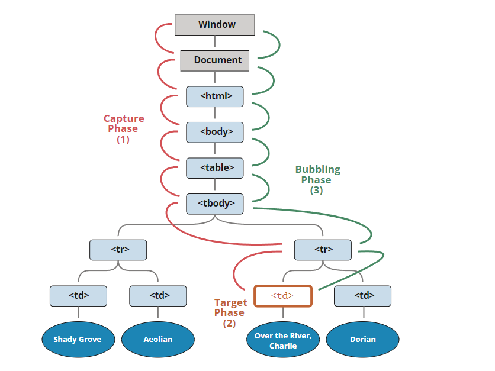

# 0504 JS

### 1. Promise와 Callback 차이를 설명해주세요

 callback을 사용하면 비동기 로직의 결과값을 처리하기 위해서는 callback안에서만 처리를 해야하고, 콜백 밖에서는 비동기에서 온 값을 알 수가 없습니다. 하지만 promise를 사용하면 비동기에에서 온 값이 promise 객체에 저장되기 때문에 코드 작성이 용이해집니다.

또, Promise 클래스는 비동기 처리만을 위해 만들어졌기 때문에 클래스에 resolve나 reject 함수들이 잘 정의되어 있고 이를 잘 활용하기만 하면 되지만, callback pattern은 자유도가 높지만 template이 존재하지 않기 때문에 코드가 복잡해지고 에러 처리 같은 작업들이 어렵습니다.

추가적으로 비동기 처리를 위해 최근에 나온 async & await 문법이 있으며,
존의 비동기 처리 방식인 콜백 함수와 프로미스의 단점을 보완하고 개발자가 읽기 좋은 코드를 작성할 수 있게 도와줍니다

---

### 2. 이벤트 버블링 대해 설명해주세요

버블링(bubbling)의 원리는 간단합니다.

**한 요소에 이벤트가 발생하면, 이 요소에 할당된 핸들러가 동작하고, 이어서 부모 요소의 핸들러가 동작합니다. 가장 최상단의 조상 요소를 만날 때까지 이 과정이 반복되면서 요소 각각에 할당된 핸들러가 동작합니다.**

3개의 요소가 `FORM > DIV > P` 형태로 중첩된 구조를 살펴봅시다. 요소 각각에 핸들러가 할당되어 있습니다.

```html
<style>
  body * {
    margin: 10px;
    border: 1px solid blue;
  }
</style>

<form onclick="alert('form')">FORM
  <div onclick="alert('div')">DIV
    <p onclick="alert('p')">P</p>
  </div>
</form>
```


가장 안쪽의 <p>를 클릭하면 순서대로 다음과 같은 일이 벌어집니다.

```python
1. `<p>`에 할당된 `onclick` 핸들러가 동작합니다.
2. 바깥의 `<div>`에 할당된 핸들러가 동작합니다.
3. 그 바깥의 `<form>`에 할당된 핸들러가 동작합니다.
4. `document` 객체를 만날 때까지, 각 요소에 할당된 `onclick` 핸들러가 동작합니다.
```


이런 동작 방식 때문에 <p> 요소를 클릭하면 p → div → form 순서로 3개의 얼럿 창이 뜨는것이죠.

이런 흐름을 '이벤트 버블링’이라고 부릅니다. 이벤트가 제일 깊은 곳에 있는 요소에서 시작해 부모 요소를 거슬러 올라가며 발생하는 모양이 마치 물속 거품(bubble)과 닮았기 때문입니다.

---

### 3. 캡처링에 대해 설명해주세요.

이벤트엔 버블링 이외에도 ‘캡처링(capturing)’ 이라는 흐름이 존재합니다. 실제 코드에서 자주 쓰이진 않지만, 종종 유용한 경우가 있으므로 알아봅시다.

표준 [DOM 이벤트](http://www.w3.org/TR/DOM-Level-3-Events/)에서 정의한 이벤트 흐름엔 3가지 단계가 있습니다.

```python
1. 캡처링 단계 – 이벤트가 하위 요소로 전파되는 단계
2. 타깃 단계 – 이벤트가 실제 타깃 요소에 전달되는 단계
3. 버블링 단계 – 이벤트가 상위 요소로 전파되는 단계
```



`<td>`를 클릭하면 이벤트가 최상위 조상에서 시작해 아래로 전파되고(캡처링 단계), 이벤트가 타깃 요소에 도착해 실행된 후(타깃 단계), 다시 위로 전파됩니다(버블링 단계). 이런 과정을 통해 요소에 할당된 이벤트 핸들러가 호출됩니다.

**캡처링 단계를 이용해야 하는 경우는 흔치 않기 때문에, 이전까진 주로 버블링만 설명했습니다. 캡처링에 관한 코드를 발견하는 일은 거의 없을 겁니다.**

`on<event>` 프로퍼티나 HTML 속성, `addEventListener(event, handler)`를 이용해 할당된 핸들러는 캡처링에 대해 전혀 알 수 없습니다. 이 핸들러들은 두 번째 혹은 세 번째 단계의 이벤트 흐름(타깃 단계와 버블링 단계)에서만 동작합니다.

캡처링 단계에서 이벤트를 잡아내려면 `addEventListener`의 `capture` 옵션을 `true`로 설정해야 합니다.

---

### 4. 클로져(Closure)에 대해 설명해주세요.

#### 함수와 함수가 선언된 어휘적(lexical) 환경의 조합

- 클로저는 함수를 지칭하고 또 그 함수가 선언된 환경과의 관계라는 개념이 합쳐진것이다.

#### 클로저의 핵심은 스코프를 이용해서, 변수의 접근 범위를 닫는(폐쇄)것에 있다.

- 외부함수 스코프에서 내부함수 스코프로 접근 불가능하다.
- 내부함수에서는 외부함수 스코프에서 선언된 변수에 접근 기능하다.
- 따라서 내부 함수는 외부함수에 선언된 변수에 접근 가능하다.

#### 함수가 호출되는 환경과 별개로, 기존에 선언되어 있던 환경(어휘적 환경)을 기준으로 변수를 조회한다.

- 외부함수의 실행이 종료된 후에도, 클로저 함수는 외부함수의 스코프, 즉, 함수가 선언된 어휘적 환경에 접근할 수 있습니다.
- 외부 함수 스코프가 내부함수에 의해 언제든지 참조될 수 있다.
- 따라서 클로저를 남발할 경우 퍼포먼스 저하가 발생할 수도 있습니다.

#### 상위 스코프의 식별자를 포함하여 쓰여있는 내부 함수 코드 자체를 어휘적 환경(lexical environment)라고 부를 수 있다.


#### ❗️장점1. 데이터를 보존할 수 있다.

클로저 함수는 외부 함수의 실행이 끝나더라도 외부 함수 내 변수를 사용할 수 있다.

클로저는 이처럼 특정 데이터를 스코프 안에 가두어 둔 채로 계속 사용할 수 있게하는 폐쇄성을 갖는다.

#### ❗️장점2. 정보의 접근 제한 (캡슐화)

‘클로저 모듈 패턴’을 사용해 객체에 담아 여러 개의 함수를 리턴하도록 만든다.

이러한 정보의 접근을 제한하는 것을 캡슐화라고 한다.

#### ❗️장점3. 모듈화에 유리하다.

클로저 함수를 각각의 변수에 할당하면 각자 독립적으로 값을 사용하고 보존할 수 있다.

이와 같이 함수의 재사용성을 극대화 함수 하나를 독립적인 부품의 형태로 분리하는 것을 모듈화라고한다.

클로저를 통해 데이터와 메소드를 묶어다닐 수 있기에 클로저는 모듈화에 유리하다.

---

### 5. 프로토타입에 대해 설명해주세요.

**정의** : 프로토타입(prototype)은 원래의 형태 또는 전형적인 예, 기초 또는 표준이다. 시제품이 나오기 전의 제품의 원형으로 개발검증과 양산 검증을 거쳐야 시제품이 될 수 있다. 프로토타입은 '정보시스템의 미완성 버전 또는 중요한 기능들이 포함되어 있는 시스템의 초기모델'이다. 이 프로토타입은 사용자의 모든 요구사항이 정확하게 반영할 때까지 계속해서 개선/보완 된다. 실제로 많은 애플리케이션들이 지속적인 프로토타입의 확장과 보강을 통해 최종 설계가 승인된다.


#### 프로토타이핑의 장단점

#### 장점

- 프로토타이핑은 사용자 중심의 개발 방법이다. 프로토타이핑의 중요한 목적 중의 하나가 바로 최종사용자의 요구를 극대화하는 것이다.
- 개발시간을 줄일 수 있다. 전통적인 방법으로는 운영 가능한 시스템이 나오기까지 오랜 시간이 걸리지만 프로토타이핑은 비교적 빠른 기간 안에 사용자가 평가할 수 있을 만한 결과를 만들어낸다.
- 오류를 초기에 발견할 수 있다. 전통적인 방법으로는 시스템이 완성된 후에야 오류를 발견할 수 있다. 따라서 시스템 개발기간이 3년이라면 오류를 발견하기까지 적어도 3년의 시간이 소요될 수 있다. 그러나 프로토타이핑은 개발 초기단계에서 오류를 판별 할 수 있도록 해준다.
- 변경이 용이하다. 사용자나 관리자는 현재까지의 개발 진행된 프로토타입을 직접 운영함으로써 여러 가지 제안과 변경할 점을 파악할 수 있고, 이러한 사항들은 진행되고 있는 개발과정에 반영하게 된다.

#### 단점

- 시스템의 유지보수에 필수적인 시스템의 문서화 과정이 지나치게 축소되거나 생략될 수 있다. 단기적으로 볼 때는 이런 문서들이 별로 도움이 되지 않을 수 있다. 그러나 시간이 흐름에 따라 시스템의 수정과 보수가 필요하게 될 때, 시스템에 관련된 문서가 없다면 유지보수에 불필요한 노력이 따른다.
- 최종적으로 시간과 비용이 훨씬 많이 들 수 있다. 프로토타이핑은 언제든지 변경이 용이하지만 이러한 시스템의 변경이 계속될수록 시간과 비용은 많이 들게 된다.
- 프로토타이핑으로 완성된 시스템은 컴퓨터 자원의 활용 측면에서 볼 때 효율적이지 못하다. 이 개발방법은 자원의 효율성보다는 사용자 요구에 의해 개발되기 때문에 저장장치, 파일시스템, 중앙처리장치 등 하드웨어나 주변기기의 효율성이 무시되기 쉽다. 그러나 최근 컴퓨터 관련 기기들의 성능은 좋아지는 반면 가격은 하락하면서 이 문제의 비중은 크게 감소되고 있다.
